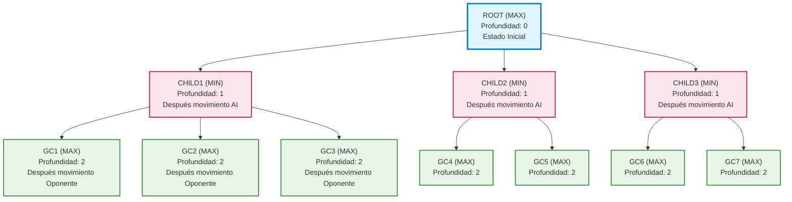
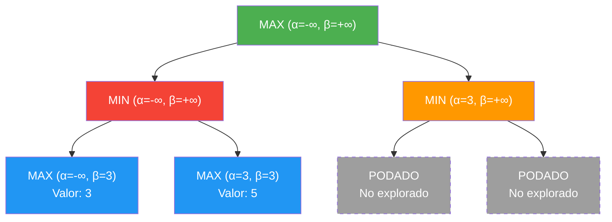
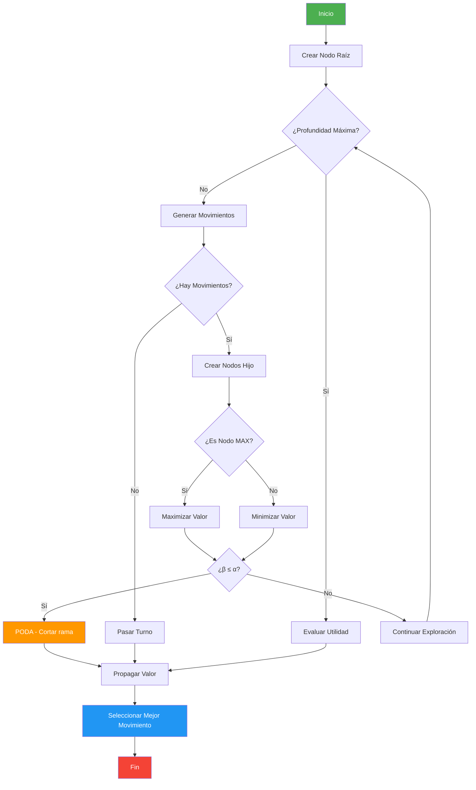

# Implementación MINIMAX con Poda Alfa-Beta para Othello

## Descripción General

Este proyecto implementa un agente inteligente capaz de jugar Othello utilizando el algoritmo MINIMAX con optimización de poda alfa-beta. La implementación está desarrollada en C# para Unity y proporciona una inteligencia artificial competitiva que evalúa múltiples factores estratégicos para tomar decisiones óptimas.

## Arquitectura del Sistema

### Estructura de Datos Principal

#### Clase Node
La clase `Node` representa cada estado del juego en el árbol de búsqueda MINIMAX:

```csharp
public class Node
{
    public Tile[] board;        // Estado del tablero
    public Node parent;         // Nodo padre
    public List<Node> childList; // Lista de nodos hijo
    public int type;           // Constants.MIN o Constants.MAX
    public double utility;     // Valor de utilidad del nodo
    public double alfa;        // Valor alfa para poda
    public double beta;        // Valor beta para poda
    public int movePosition;   // Posición del movimiento
    public int depth;          // Profundidad en el árbol
}
```

### Diagrama de Arquitectura del Árbol MINIMAX



Donde:
- **ROOT**: Estado inicial del juego (nodo MAX)
- **CHILD**: Estados después del movimiento del jugador AI
- **GC (GrandChild)**: Estados después del movimiento del oponente

## Algoritmo MINIMAX con Poda Alfa-Beta

### Funcionamiento del MINIMAX

El algoritmo MINIMAX explora recursivamente el árbol de estados del juego alternando entre dos tipos de nodos:

1. **Nodos MAX**: Representan turnos del jugador AI (maximiza la utilidad)
2. **Nodos MIN**: Representan turnos del oponente (minimiza la utilidad del AI)

### Pseudocódigo del Algoritmo

```
función MINIMAX-ALFA-BETA(nodo, profundidad, alfa, beta, jugadorMaximizador)
    si profundidad = 0 O nodo es terminal entonces
        retornar EVALUAR(nodo)
    
    si jugadorMaximizador entonces
        valorMax = -∞
        para cada hijo de nodo hacer
            valor = MINIMAX-ALFA-BETA(hijo, profundidad-1, alfa, beta, FALSO)
            valorMax = max(valorMax, valor)
            alfa = max(alfa, valorMax)
            si beta ≤ alfa entonces
                romper    // Poda beta
        retornar valorMax
    sino
        valorMin = +∞
        para cada hijo de nodo hacer
            valor = MINIMAX-ALFA-BETA(hijo, profundidad-1, alfa, beta, VERDADERO)
            valorMin = min(valorMin, valor)
            beta = min(beta, valorMin)
            si beta ≤ alfa entonces
                romper    // Poda alfa
        retornar valorMin
```

### Condiciones de Poda

La poda alfa-beta se activa cuando se cumple la condición:

**β ≤ α**

Donde:
- **α**: Mejor valor encontrado hasta ahora para el jugador MAX
- **β**: Mejor valor encontrado hasta ahora para el jugador MIN

### Diagrama de Poda Alfa-Beta



En este ejemplo, cuando el segundo nodo MIN obtiene un valor de 3, y el siguiente nodo MAX devuelve 5, se produce poda porque β(3) ≤ α(3).

## Función de Utilidad

### Componentes de Evaluación

La función de utilidad combina múltiples factores estratégicos:

#### 1. Diferencia de Fichas
```
U₁ = FichasPropias - FichasOponente
```

#### 2. Control de Esquinas
```
U₂ = 25 × (EsquinasPropias - EsquinasOponente)
```

Las esquinas evaluadas son: posiciones [0, 7, 56, 63] en un tablero lineal de 64 posiciones.

#### 3. Control de Bordes
```
U₃ = 5 × (BordesPropios - BordesOponente)
```

Donde una posición de borde cumple:
```
EsBorde(posición) = (fila = 0) ∨ (fila = 7) ∨ (columna = 0) ∨ (columna = 7)
```

#### 4. Movilidad
```
U₄ = 2 × (MovimientosPropios - MovimientosOponente)
```

#### 5. Bonificación de Final de Juego
```
U₅ = {
    +1000,  si FichasOponente = 0 (victoria total)
    -1000,  si FichasPropias = 0 (derrota total)
    +500,   si tablero completo y FichasPropias > FichasOponente
    -500,   si tablero completo y FichasPropias < FichasOponente
    0,      en otros casos
}
```

### Función de Utilidad Total

```
U(estado) = U₁ + U₂ + U₃ + U₄ + U₅
```

## Proceso de Toma de Decisiones

### Flujo del Algoritmo



1. **Inicialización**: Se crea el nodo raíz con el estado actual del tablero
2. **Generación del Árbol**: Se exploran recursivamente los movimientos posibles hasta la profundidad máxima
3. **Evaluación**: Se aplica la función de utilidad a los nodos terminales
4. **Propagación**: Los valores se propagan hacia arriba usando MINIMAX
5. **Poda**: Se eliminan ramas que no pueden mejorar el resultado
6. **Selección**: Se elige el movimiento correspondiente al hijo con mejor utilidad

## Optimizaciones Implementadas

### Poda Alfa-Beta
- Reduce significativamente el número de nodos explorados
- Mantiene el resultado óptimo del MINIMAX básico
- Eficiencia típica: 30-70% de nodos podados

### Manejo de Casos Especiales
- **Pasar Turno**: Cuando un jugador no tiene movimientos válidos
- **Fin de Juego**: Detección automática de victoria/derrota/empate
- **Restauración de Estado**: Preservación del valor original de la variable `turn`

## Configuración y Parámetros

### Profundidad del Árbol
```csharp
private int maxDepth = 4;
```

Valores recomendados:
- **Profundidad 2**: Respuesta muy rápida, estrategia básica
- **Profundidad 3**: Balance entre velocidad y calidad
- **Profundidad 4**: Máxima calidad estratégica (recomendado)

### Pesos de la Función de Utilidad

| Factor | Peso | Justificación |
|--------|------|---------------|
| Esquinas | 25 | Posiciones irreversibles de alto valor |
| Bordes | 5 | Posiciones estables de valor medio |
| Movilidad | 2 | Flexibilidad estratégica |
| Fichas | 1 | Valor base del material |

## Complejidad Computacional

### Sin Poda
- **Temporal**: O(b^d) donde b es el factor de ramificación promedio y d la profundidad
- **Espacial**: O(d) para la pila de recursión

### Con Poda Alfa-Beta
- **Mejor caso**: O(b^(d/2))
- **Caso promedio**: O(b^(3d/4))
- **Peor caso**: O(b^d) (sin poda efectiva)

## Resultados Esperados

### Rendimiento del Algoritmo
- **Profundidad 4**: ~100-500 nodos explorados por movimiento
- **Tiempo de respuesta**: <1 segundo en hardware moderno
- **Calidad de juego**: Nivel competitivo contra jugadores humanos

### Estrategias Emergentes
La IA desarrolla automáticamente estrategias avanzadas:
- Priorización de esquinas
- Control de bordes
- Maximización de opciones
- Reconocimiento de patrones de final de juego

## Consideraciones de Implementación

### Gestión de Memoria
- Creación dinámica de nodos durante la exploración
- Liberación automática por el garbage collector de Unity
- Copia profunda de tableros para evitar efectos secundarios

### Robustez
- Validación de movimientos antes de aplicarlos
- Manejo de casos límite (tablero lleno, sin movimientos)
- Restauración garantizada del estado original

## Conclusiones

Esta implementación proporciona una inteligencia artificial robusta y competitiva para Othello, combinando la exploración exhaustiva del MINIMAX con la eficiencia de la poda alfa-beta y una función de evaluación multi-factorial que captura los aspectos estratégicos clave del juego.